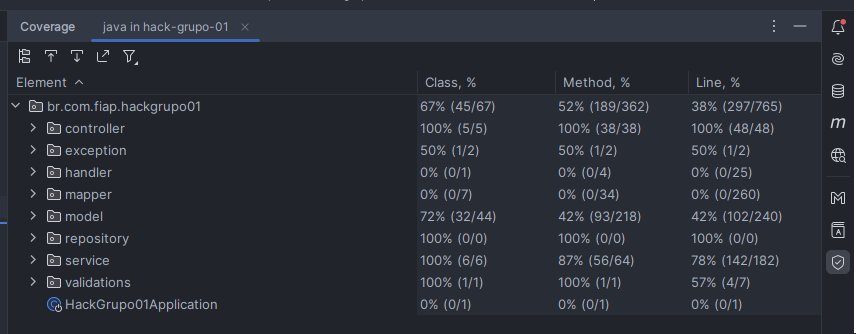

# 🐋 Rodanddo o projeto com Docker

1 - Antes de qualquer coisa certifique-se de ter o Docker já instalado e configurado em sua maquina:
- https://docs.docker.com/get-docker/

2 -  Abra o terminal no caminho do arquivo ``docker-compose.yml``:

3 -  Execulte o seguinte comando no terminal:
```
docker-compose up
```
4 - Para acessar a ferramenta phpMyAdmin para ter acesso ao banco de dados basta inserir a url no seu navegador de preferência:
```
http://localhost:8000/
```
6 - Entre com usuario e senha configurado no ``application.yml`` que esta como padrão:
- Usuario: ``root``
- Senha: ``root``

# 📗 Acessando o Swagger
A documentação da API da nossa aplicação está disponível através do Swagger,
uma interface interativa que permite explorar e testar os endpoints da API.
Siga os passos abaixo para acessar o Swagger:

1 - Certifique-se de que a aplicação esteja em execução.

2 - Abra seu navegador da web favorito.

3 - Acesse a URL:
```
http://localhost:8080/swagger-ui/index.html#/
```
Agora você está na interface do Swagger, onde pode ver a lista de todos os endpoints disponíveis, seus detalhes e parâmetros. Explore e teste os endpoints interativamente.

# 📋 Cobertura de testes


# 🔳 Comandos CURL

## Gestão de quartos

### Cadastro de hospedagem

```bash
curl -X POST http://localhost:8080/hospedagem -H "Content-Type: application/json" -d "{\"nome\": \"Nova Hospedagem\", \"amenidades\": [\"Wi-Fi\", \"TV\"], \"endereco\": {\"ruaAvenida\": \"Rua Nova\", \"cep\": \"54321-987\", \"cidade\": \"Nova Cidade\", \"estado\": \"Novo Estado\"}}"
```
### Cadastro de prédio

```bash
curl -X POST http://localhost:8080/hospedagem/predio -H "Content-Type: application/json" -d "{\"nome\": \"Novo Prédio\", \"hospedagem\": {\"id\": 2}}"
```

### Cadastro de quarto

```bash
curl -X POST "http://localhost:8080/hospedagem/quarto" -H "Content-Type: application/json" -d "{\"tipo\": \"Quarto Standard\", \"totalPessoas\": 2, \"camas\": [\"Cama de Casal\"], \"outrosMoveis\": [\"Mesa de Trabalho\"], \"banheiro\": [\"Chuveiro\", \"Pia\"], \"valorDiaria\": 100.0, \"quantidade\": 5, \"predio\": {\"id\": 456}}"
```

### Buscar hospedagem por id

```bash
curl -X GET http://localhost:8080/hospedagem/3
```

### Alterar hospedagem

```bash
curl -X PUT http://localhost:8080/hospedagem/3 -H "Content-Type: application/json" -d "{\"nome\": \"Novo Nome da Hospedagem\", \"amenidades\": [\"Wi-Fi\", \"TV\"], \"endereco\": {\"ruaAvenida\": \"Rua Nova\", \"cep\": \"54321-987\", \"cidade\": \"Nova Cidade\", \"estado\": \"Novo Estado\"}}"
```

### Deletar hospedagem por id

```bash
curl -X DELETE http://localhost:8080/hospedagem/3
```

### Buscar hospedagem por id do quarto

```bash
curl -X GET http://localhost:8080/hospedagem/quarto/5
```

### Alterar quarto

```bash
curl -X PUT "http://localhost:8080/hospedagem/quarto/456" -H "Content-Type: application/json" -d "{\"tipo\": \"Quarto Luxo\", \"totalPessoas\": 3, \"camas\": [\"Cama de Casal\", \"Cama de Solteiro\"], \"outrosMoveis\": [\"Mesa de Trabalho\"], \"banheiro\": [\"Chuveiro\", \"Pia\", \"Banheira\"], \"valorDiaria\": 150.0, \"quantidade\": 10}"
```

### Deletar quarto por id

```bash
curl -X DELETE "http://localhost:8080/hospedagem/quarto/456"
```

### Buscar hospedagem por id do prédio

```bash
curl -X GET http://localhost:8080/hospedagem/predio/5
```

### Alterar prédio

```bash
curl -X PUT http://localhost:8080/hospedagem/predio/5 -H "Content-Type: application/json" -d "{\"nome\": \"Novo Nome do Prédio.\"}"
```

### Deletar prédio por id

```bash
curl -X DELETE http://localhost:8080/hospedagem/predio/5
```

### Buscar todas as hospedagens

```bash
curl -X GET http://localhost:8080/hospedagem
```
## Gestão de serviços e opcionais

###  Cadastro de serviço

```bash
curl -X POST "http://localhost:8080/servico" -H "Content-Type: application/json" -d "{\"nome\": \"Nome do Serviço\", \"valor\": 30.00, \"hospedagem\": {\"id\": 1}}"
```

###  Cadastro de item

```bash
curl -X POST "http://localhost:8080/item" -H "Content-Type: application/json" -d "{\"nome\": \"Nome do Item\", \"valor\": 20.00, \"hospedagem\": {\"id\": 1}}"
```
###  Buscar serviço por id

```bash
curl -X GET "http://localhost:8080/servico/2"
```
###  Buscar item por ID

```bash
curl -X GET "http://localhost:8080/item/456"
```

###  Buscar serviço por hospedagem

```bash
curl -X GET "http://localhost:8080/servico/hospedagem/1"
```

###  Buscar itens por hospedagem

```bash
curl -X GET "http://localhost:8080/item/hospedagem/1"
```

###  Alterar serviço

```bash
curl -X PUT "http://localhost:8080/servico/2" -H "Content-Type: application/json" -d "{\"nome\": \"Novo Nome do Serviço\", \"valor\": 50.00}"
```

###  Alterar item

```bash
curl -X PUT "http://localhost:8080/item/2" -H "Content-Type: application/json" -d "{\"nome\": \"Novo Nome do Item\", \"valor\": 25.00}"
```

###  Deletar item por ID

```bash
curl -X DELETE "http://localhost:8080/item/2"
```
###  Deletar serviço por id

```bash
curl -X DELETE "http://localhost:8080/servico/2"
```
## Gestão de clientes

### Cadastro de Cliente

```bash
curl -X POST "http://localhost:8080/cliente" -H "Content-Type: application/json" -d "{\"paisOrigem\": \"Brasil\", \"cpf\": \"12345678902\", \"passaporte\": \"ABC123\", \"nomeCompleto\": \"João Silva\", \"dataNascimento\": \"01/01/1990\", \"enderecoPaisOrigem\": \"Rua ABC, 123\", \"telefone\": \"(11) 98765-4321\", \"email\": \"joao@example.com\"}"
```

### Buscar cliente por id

```bash
curl -X GET "http://localhost:8080/cliente/1"
```

### Buscar todos os clientes

```bash
curl -X GET "http://localhost:8080/cliente"
```

### Atualizar Cliente

```bash
curl -X PUT "http://localhost:8080/cliente/1" -H "Content-Type: application/json" -d "{\"paisOrigem\": \"Brasil\", \"cpf\": \"12345678901\", \"passaporte\": \"ABC123\", \"nomeCompleto\": \"João Silva\", \"dataNascimento\": \"01/01/1990\", \"enderecoPaisOrigem\": \"Rua ABC, 123\", \"telefone\": \"(11) 98765-4321\", \"email\": \"joao@example.com\"}"
```

### Exclusão de Cliente

```bash
curl -X DELETE "http://localhost:8080/cliente/1"
```
## Gestão de reservas

### Cadastro de Reserva
```bash
curl -X POST "http://localhost:8080/reserva" -H "Content-Type: application/json" -d "{\"cliente\": {\"id\": 1}, \"quarto\": {\"id\": 1}, \"entrada\": \"2024-03-14\", \"saida\": \"2024-03-15\", \"quantidadeHospedes\": 2, \"itens\": [{\"quantidade\": 1, \"item\": {\"id\": 1}}], \"servicos\": [{\"servico\": {\"id\": 1}}]}"
```

### Edição de Reserva

```bash
curl -X PUT "http://localhost:8080/reserva/1" -H "Content-Type: application/json" -d "{\"quarto\": {\"id\": 1}, \"entrada\": \"2024-06-15\", \"saida\": \"2024-06-16\", \"quantidadeHospedes\": 2, \"itens\": [{\"quantidade\": 1, \"item\": {\"id\": 1}}], \"servicos\": [{\"servico\": {\"id\": 1}}]}"
```

### Exclusão de Reserva

```bash
curl -X DELETE "http://localhost:8080/reserva/1"
```

### Buscar quartos disponíveis

```bash
curl -X GET "http://localhost:8080/reserva?quantidade=2&entrada=2024-03-12&saida=2024-03-15"
```

### Buscar todas as reservas do cliente por email

```bash
curl -X GET "http://localhost:8080/reserva/cliente@example.com"
```

